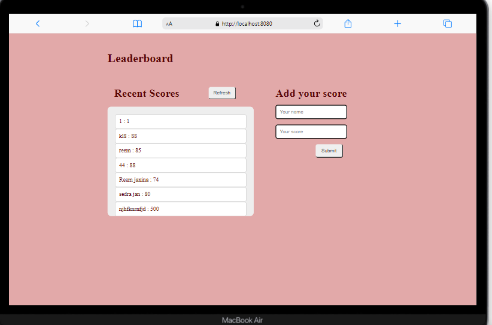

<!-- Feel Free to Add, Update, Delete Any Section you find needs so -->

# LeaderBoard

> This project A small game displays to user his score and his name, you can get it from its API and post new players and their scores to the API. 💯

<!--  -->

## Built With

- Languages: _**HTML, CSS, JavaScript**_
- Frameworks: _**N/A**_
- Technologies used: _**GIT, GITHUB, LINTERS**_

## Additional tools
 - Google fonts
 - Webpack 

<!-- 
 ## Live Demo

[See My project Live here]()  -->

## Authors

<!-- Only Change Username for Different Accounts -->

👤 **Reem**

 Platform | Badge |
 --- | --- |
 **GitHub**  | [@Reem-lab](https://github.com/Reem-lab)
 **Twitter** | [Rem79940127](https://twitter.com/Rem79940127)
 **LinkdIn** | [reem-janina](https://www.linkedin.com/in/reem-janina-ab74ab21a/)

## 🤝 Contributing

Contributions, issues, and feature requests are welcome!

Feel free to check the [issues page](https://github.com/MrRamoun/WEBDEV/issues).

## Show your support

Give a ⭐️ if you like this project!

## Acknowledgments

- Hat tip to anyone whose code was used
- Inspiration
- etc

## 📝 License

This project is [MIT](/LICENSE) licensed.
